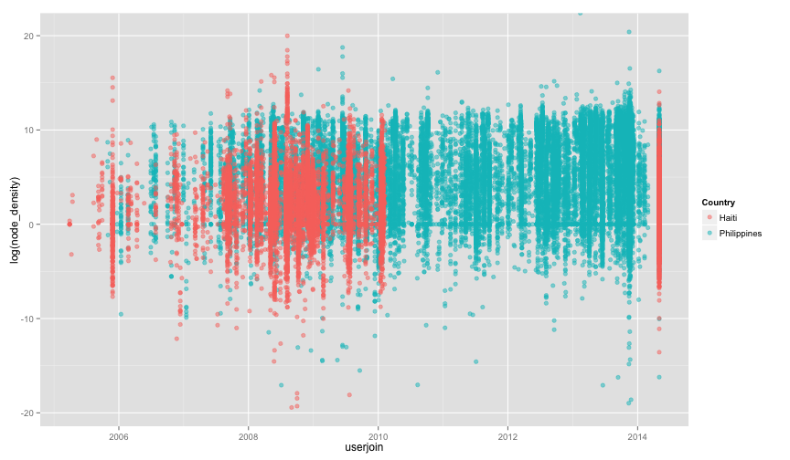

Changeset Analysis
========================================================
Looking at OSM changeset density


### Plot Node count vs area

```r
ggplot(aes(x = log(node_count), y = log(area), color = Country), data = dat) + 
    geom_point(shape = 19, alpha = 1/2)
```

 


### Plotting Node Density against user joining date

```r
# Plot them against eachother:
ggplot(aes(x = userjoin, y = log(node_density), color = Country), data = dat) + 
    geom_point(shape = 19, alpha = 1/2)
```

 


```r
plot(x = phil_info$userjoin, y = phil_info$node_density, main = "Philippines: Density vs. when joined")
```

 

