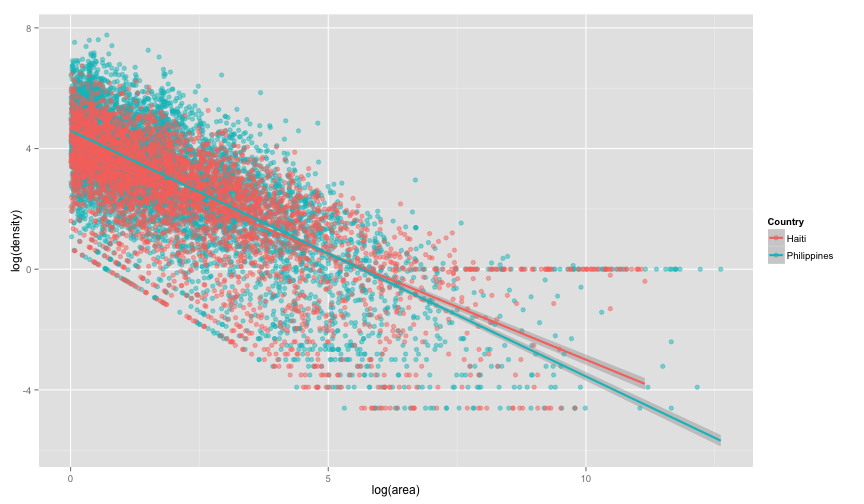

Changeset Analysis
========================================================
Looking at OSM changeset density


Load the Data from the disaster window CSV


### Summary Statistics of the data
Philippines

```r
summary(philippines$node_count)
```

```
##    Min. 1st Qu.  Median    Mean 3rd Qu.    Max. 
##       1       4      16     103      78   19400
```

```r
summary(philippines$area)
```

```
##    Min. 1st Qu.  Median    Mean 3rd Qu.    Max. 
##       0       0       0      99       0  301000
```

```r
summary(philippines$density)
```

```
##    Min. 1st Qu.  Median    Mean 3rd Qu.    Max. 
##       0     110    1130   15600   16400 2040000
```

Haiti

```r
summary(haiti$node_count)
```

```
##    Min. 1st Qu.  Median    Mean 3rd Qu.    Max. 
##       1       6      31     114      99   46500
```

```r
summary(haiti$area)
```

```
##    Min. 1st Qu.  Median    Mean 3rd Qu.    Max. 
##       0       0       0     173       3   69200
```

```r
summary(haiti$density)
```

```
##     Min.  1st Qu.   Median     Mean  3rd Qu.     Max. 
## 0.00e+00 7.00e+00 5.80e+01 1.18e+05 2.77e+02 9.64e+08
```


```r
log <- function(x) ifelse(x <= 0, 0, base::log(x))  #Redefine log to return 0 when undefined...
```


### Plot Node count vs area

```r
ggplot(data = dat, aes(x = log(node_count), y = log(area), color = Country)) + 
    geom_point(shape = 19, alpha = 1/2) + stat_smooth(aes(x = log(node_count), 
    y = log(area), color = Country), method = "lm", formula = y ~ x, size = 1)
```

 


### Histogram of densities

```r
ggplot(dat, aes(log(density), fill = Country)) + geom_histogram(alpha = 0.5, 
    binwidth = 0.1, position = "identity")
```

 


### What about just density overtime?

```r
ggplot(data = dat[dat$area > 1, ], aes(x = log(area), y = log(density), color = Country)) + 
    geom_point(shape = 19, alpha = 1/2) + stat_smooth(method = "lm", size = 1)
```

 


### Plotting Node Density against user joining date

```r
# Plot them against eachother:
ggplot(aes(x = userjoin, y = log(node_density), color = Country), data = dat) + 
    geom_point(shape = 19, alpha = 1/2)
```

```
## Error: object 'userjoin' not found
```


